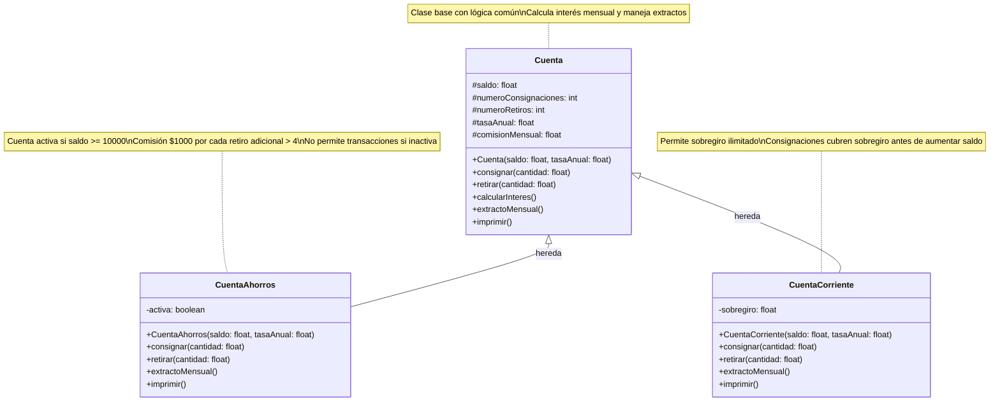

# Proyecto de Herencia - Cuentas Bancarias

Este proyecto demuestra el concepto de herencia en Java mediante la implementación de un sistema de cuentas bancarias.

## Diagrama de Clases



## Descripción

- **Cuenta**: Clase base que maneja saldo, consignaciones, retiros, tasa anual y comisión mensual.
- **CuentaAhorros**: Hereda de Cuenta. Se activa con saldo >= 10000. Cobra comisión por retiros extras.
- **CuentaCorriente**: Hereda de Cuenta. Permite sobregiro y maneja consignaciones para cubrirlo.

## Cómo ejecutar

```bash
mvn compile
mvn exec:java
```

## Requisitos

- Java 17
- Maven