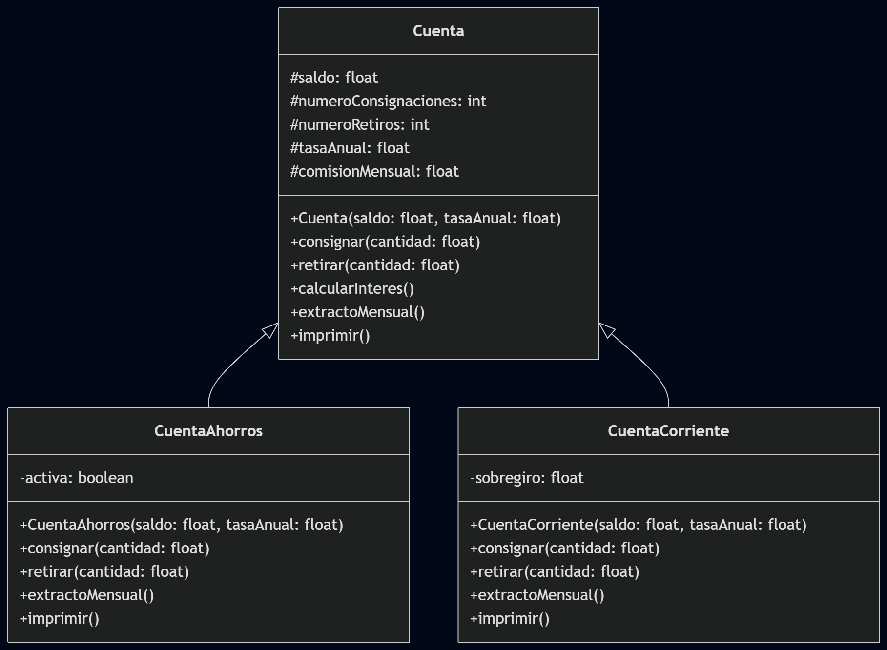

# Proyecto de Herencia - Cuentas Bancarias

## Diagrama de Clases

## Descripción

Este proyecto implementa un sistema de cuentas bancarias utilizando herencia en Java. La clase base `Cuenta` proporciona la funcionalidad común, mientras que `CuentaAhorros` y `CuentaCorriente` extienden esta clase con comportamientos específicos.

### Características Principales

- **Cuenta de Ahorros**: Se activa con saldo mínimo de $10,000. Cobra comisión por retiros adicionales.
- **Cuenta Corriente**: Permite sobregiro y maneja consignaciones para cubrirlo primero.

## Cómo Ejecutar

1. Asegúrate de tener Maven instalado.
2. Navega al directorio del proyecto.
3. Ejecuta `mvn compile` para compilar.
4. Ejecuta `mvn exec:java` para correr el programa.